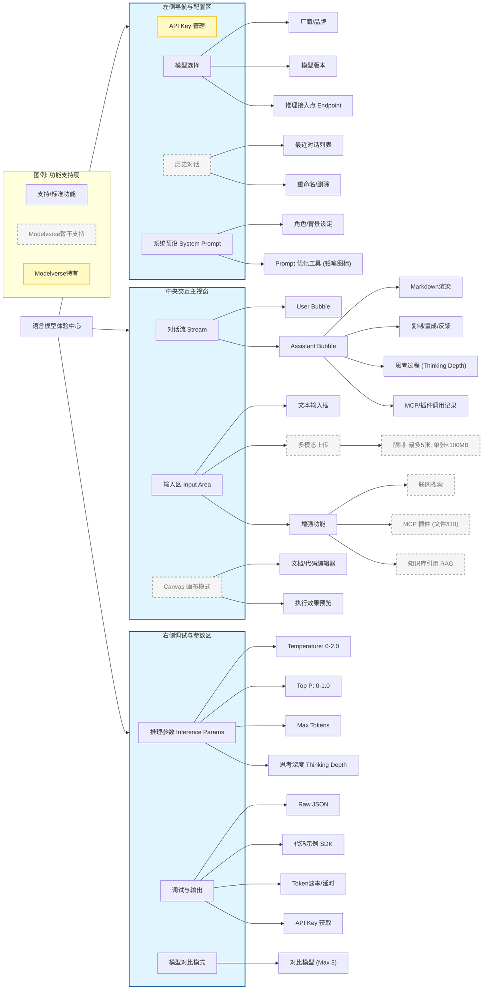

# 语言模型 (LLM) 体验中心信息结构

> 基于火山方舟 (Volcengine Ark) 体验中心典型范式梳理 - **布局树状图 (Updated)**
> *Ref: https://www.volcengine.com/docs/82379/1099504*

```mermaid
graph LR
    Root[语言模型体验中心]

    %% 布局区域定义
    subgraph Layout_Left [左侧导航与配置区]
        direction TB
        API_Key[API Key 管理]:::unique
        ModelSelect[模型选择]
        History[历史对话]
        SysPrompt[系统预设 System Prompt]
    end

    subgraph Layout_Center [中央交互主视窗]
        direction TB
        ChatStream[对话流 Stream]
        InputArea[输入区 Input Area]
        Canvas[Canvas 画布模式]
    end

    subgraph Layout_Right [右侧调试与参数区]
        direction TB
        InferenceParams[推理参数 Inference Params]
        DebugInfo[调试与输出]
        CompareMode[模型对比模式]
    end

    %% 结构连接
    Root --> Layout_Left
    Root --> Layout_Center
    Root --> Layout_Right

    %% 左侧详情
    ModelSelect --> M_Vendor[厂商/品牌]
    ModelSelect --> M_Ver[模型版本]
    ModelSelect --> M_Endpoint[推理接入点 Endpoint]
    
    History --> H_List[最近对话列表]
    History --> H_Action[重命名/删除]

    SysPrompt --> SP_Content[角色/背景设定]
    SysPrompt --> SP_Opt["Prompt 优化工具 (铅笔图标)"]

    %% 中央详情
    ChatStream --> Bubble_User[User Bubble]
    ChatStream --> Bubble_AI[Assistant Bubble]
    
    Bubble_AI --> AI_Content[Markdown渲染]
    Bubble_AI --> AI_Action[复制/重成/反馈]
    Bubble_AI --> AI_Reasoning["思考过程 (Thinking Depth)"]
    Bubble_AI --> AI_Tools[MCP/插件调用记录]

    InputArea --> In_Text[文本输入框]
    InputArea --> In_Upload[多模态上传]
    In_Upload --> In_UpLimit[限制: 最多5张, 单张<100MB]
    
    InputArea --> In_Feature[增强功能]
    In_Feature --> F_Search[联网搜索]
    In_Feature --> F_MCP["MCP 插件 (文件/DB)"]
    In_Feature --> F_KB[知识库引用 RAG]

    Canvas --> C_Edit[文档/代码编辑器]
    Canvas --> C_Preview[执行效果预览]

    %% 右侧详情
    InferenceParams --> P_Temp[Temperature: 0-2.0]
    InferenceParams --> P_TopP[Top P: 0-1.0]
    InferenceParams --> P_MaxToken[Max Tokens]
    InferenceParams --> P_Reason[思考深度 Thinking Depth]

    DebugInfo --> D_JSON[Raw JSON]
    DebugInfo --> D_Code[代码示例 SDK]
    DebugInfo --> D_Perf[Token速率/延时]
    DebugInfo --> D_API[API Key 获取]

    CompareMode --> CM_Slot["对比模型 (Max 3)"]

    %% 样式
    %% 样式定义
    classDef container fill:#e1f5fe,stroke:#01579b,stroke-width:2px;
    class Layout_Left,Layout_Center,Layout_Right container;
    classDef limitStyle fill:#ffcdd2,stroke:#c62828,color:#c62828;
    class In_UpLimit unsupported;
    classDef unique fill:#fff9c4,stroke:#fbc02d,stroke-width:2px,stroke-dasharray: 0;
    class API_Key unique;
    
    %% 不支持功能标注 (Modelverse Gap Analysis)
    classDef unsupported fill:#f5f5f5,stroke:#9e9e9e,stroke-width:2px,stroke-dasharray: 5 5,color:#757575;
    %% Canvas模式: Modelverse仅提供标准对话UI，无画布模式
    class Canvas unsupported;
    %% 知识库: 体验中心内无集成的RAG知识库管理
    class KnowBase unsupported;
    %% 插件系统: 无MCP插件生态
    class Plugins unsupported;
    %% 语音通话: 网页端无实时语音通话
    class VoiceCall unsupported;
    %% 历史对话: 截图未显示明显的历史会话侧边栏(可能在折叠或无持久化)
    class History unsupported;
    class In_Upload unsupported;
    class F_Search,F_MCP,F_KB unsupported;

    %% 图例
    subgraph Legend [图例: 功能支持度]
        direction LR
        L_Sup[支持/标准功能]
        L_Unsup[Modelverse暂不支持]:::unsupported
        L_Unique[Modelverse特有]:::unique
    end
```
