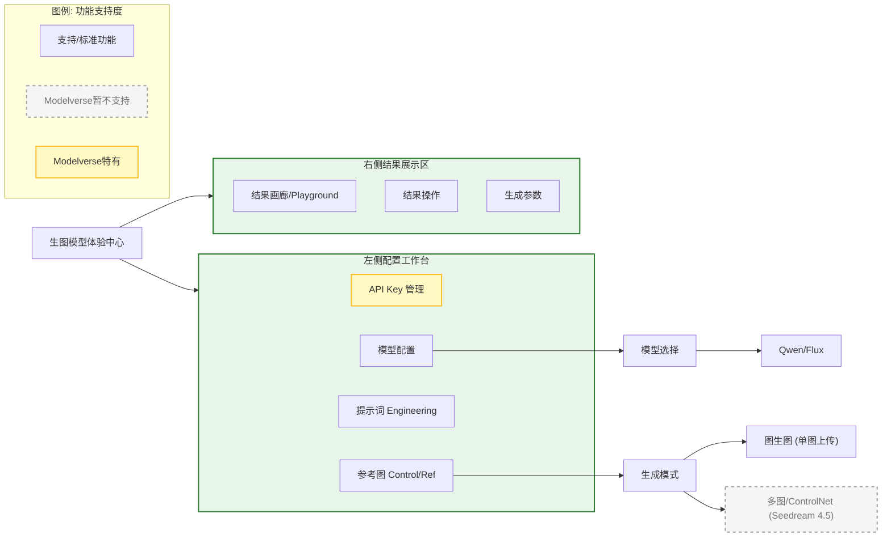

# 生图模型 (CV) 体验中心信息结构

> 基于火山方舟 (Volcengine Ark - Seedream) 体验中心典型范式梳理 - **布局树状图 (Updated)**
> *Ref: https://www.volcengine.com/docs/82379/1824121*

```mermaid
graph LR
    Root[生图模型体验中心]

    %% 布局区域
    subgraph Layout_Left [左侧配置工作台]
        direction TB
        API_Key[API Key 管理]:::unique
        ModelCfg[模型配置]
        PromptEng[提示词 Engineering]
        RefImage[参考图 Control/Ref]
    end

    subgraph Layout_Right [右侧结果展示区]
        direction TB
        Gallery[结果画廊/Playground]
        Action[结果操作]
        GenParams[生成参数]
    end

    Root --> Layout_Left
    Root --> Layout_Right
    ModelCfg --> MC_Sel[模型选择]
    MC_Sel --> MC_Ver[Qwen/Flux]
    RefImage --> RI_Mode[生成模式]
    RI_Mode --> RIM_Img["图生图 (单图上传)"]
    RI_Mode --> RIM_Multi["多图/ControlNet (Seedream 4.5)"]

    %% 样式定义
    classDef container fill:#e8f5e9,stroke:#2e7d32,stroke-width:2px;
    class Layout_Left,Layout_Right container;
    classDef unique fill:#fff9c4,stroke:#fbc02d,stroke-width:2px,stroke-dasharray: 0;
    class API_Key unique;
    
    %% 不支持功能标注 (Modelverse Gap Analysis)
    classDef unsupported fill:#f5f5f5,stroke:#9e9e9e,stroke-width:2px,stroke-dasharray: 5 5,color:#757575;
    %% 参考图控制: 复杂的ControlNet/多图参考UI暂无，仅简单参考图
    class RIM_Multi unsupported;


    %% 图例
    subgraph Legend [图例: 功能支持度]
        direction LR
        L_Sup[支持/标准功能]
        L_Unsup[Modelverse暂不支持]:::unsupported
        L_Unique[Modelverse特有]:::unique
    end
```
