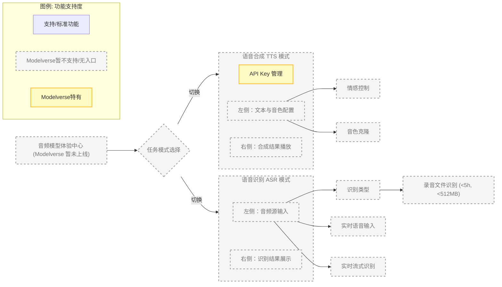

# 音频模型 (Audio) 体验中心信息结构

> 基于火山方舟 (Volcengine Ark) 体验中心典型范式梳理 - **布局树状图 (Updated)**
> *Ref: https://www.volcengine.com/docs/6561/109880*

```mermaid
graph LR
    Root["音频模型体验中心 (Modelverse 暂未上线)"]
    TabSwitch{任务模式选择}
    Root --> TabSwitch
    subgraph Mode_TTS [语音合成 TTS 模式]
        direction TB
        API_Key[API Key 管理]:::unique
        TTS_Left[左侧：文本与音色配置]
        TTS_Right[右侧：合成结果播放]
    end
    subgraph Mode_ASR [语音识别 ASR 模式]
        direction TB
        ASR_Left[左侧：音频源输入]
        ASR_Right[右侧：识别结果展示]
    end
    TabSwitch -- 切换 --> Mode_TTS
    TabSwitch -- 切换 --> Mode_ASR
    ASR_Left --> AL_Type[识别类型]
    AL_Type --> ALT_File["录音文件识别 (<5h, <512MB)"]
    ASR_Left --> ALI_Up[实时语音输入]
    TTS_Left --> TTS_Emo[情感控制]
    TTS_Left --> TTS_Clone[音色克隆]
    ASR_Left --> ASR_Realtime[实时流式识别]

    %% 样式
    %% 样式定义
    classDef container fill:#f3e5f5,stroke:#7b1fa2,stroke-width:2px;
    class Mode_TTS,Mode_ASR container;

    %% 样式
    %% 样式定义
    classDef limitStyle fill:#e1bee7,stroke:#4a148c,color:#4a148c;
    class ALT_File,ALI_Up limitStyle;
    classDef unique fill:#fff9c4,stroke:#fbc02d,stroke-width:2px,stroke-dasharray: 0;
    class API_Key unique;
    classDef unsupported fill:#f5f5f5,stroke:#9e9e9e,stroke-width:2px,stroke-dasharray: 5 5,color:#757575;
    class Root,Mode_TTS,Mode_ASR,TabSwitch unsupported;
    class TTS_Emo,TTS_Clone unsupported;
    class ASR_Realtime unsupported;
    class ALT_File,ALI_Up unsupported;
    class TTS_Left,TTS_Right,ASR_Left,ASR_Right unsupported;
    class AL_Type,ALI_Up unsupported;

    %% 图例
    subgraph Legend [图例: 功能支持度]
        direction LR
        L_Sup[支持/标准功能]
        L_Unsup[Modelverse暂不支持/无入口]:::unsupported
        L_Unique[Modelverse特有]:::unique
    end
```
